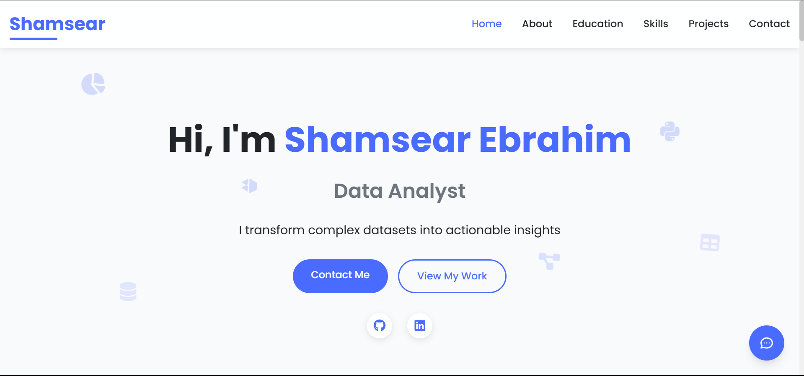

# Shamsear Ebrahim - Portfolio



## 🚀 Live Demo

Visit the live portfolio: [https://shamsear.vercel.app](https://shamsear.vercel.app)

## 📋 Overview

A modern, responsive portfolio website showcasing my skills, projects, and experience as a Data Analyst. Built with HTML, CSS, and JavaScript with Tailwind CSS for styling.

## ✨ Features

- **Responsive Design**: Fully responsive layout that works on all devices
- **Interactive UI**: Smooth animations and transitions for enhanced user experience
- **Project Showcase**: Filterable projects section to highlight my work
- **Skills Visualization**: Visual representation of technical skills
- **Contact Form**: Integrated contact form using EmailJS
- **Modern Design**: Clean and professional look with subtle animations

## 🛠️ Projects Featured

1. **AI Job Trends** - Power BI analysis of AI job market trends and skills demand
2. **Sales Insights Dashboard** - Interactive Power BI dashboard for business intelligence
3. **Hanao Data Analysis** - Excel-based data analysis with advanced visualizations
4. **Eskimos Road to Glory** - FIFA Pro Clubs community platform
5. **SS League Auction** - Football auction platform for PES Super League

## 💻 Technologies Used

- HTML5
- CSS3
- JavaScript
- Tailwind CSS
- Font Awesome
- EmailJS
- Power BI

## 📱 Responsive Design

The portfolio is fully responsive and optimized for:
- Desktop displays
- Tablets
- Mobile devices

## 🔧 Setup and Usage

1. Clone the repository:
   ```
   git clone https://github.com/Shamsear/portfolio.git
   ```

2. Open the project folder:
   ```
   cd portfolio
   ```

3. Open `index.html` in your browser or use a local server.

## 📞 Contact

- Email: shamsear@gmail.com
- LinkedIn: [linkedin.com/in/shamsear](https://linkedin.com/in/shamsear/)
- GitHub: [github.com/Shamsear](https://github.com/Shamsear)

## 📄 License

This project is licensed under the MIT License - see the LICENSE file for details.

---

© 2025 Shamsear Ebrahim. All Rights Reserved. 